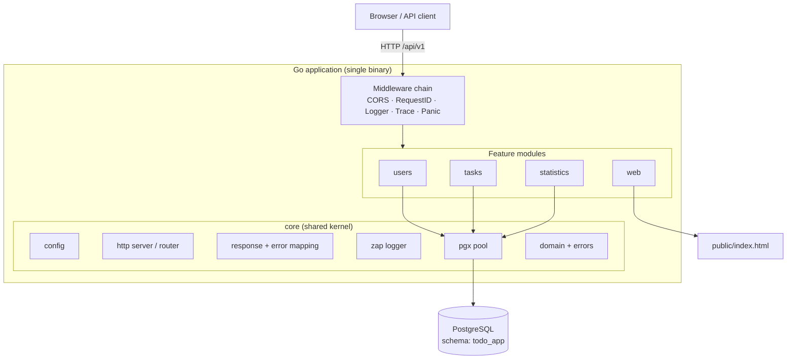
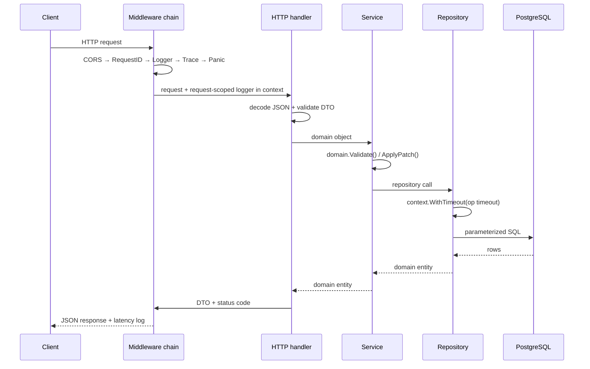
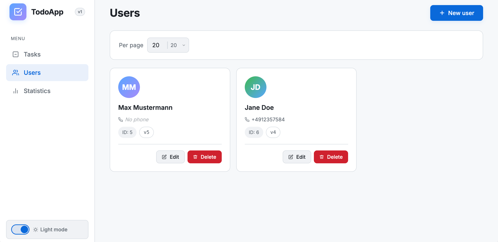
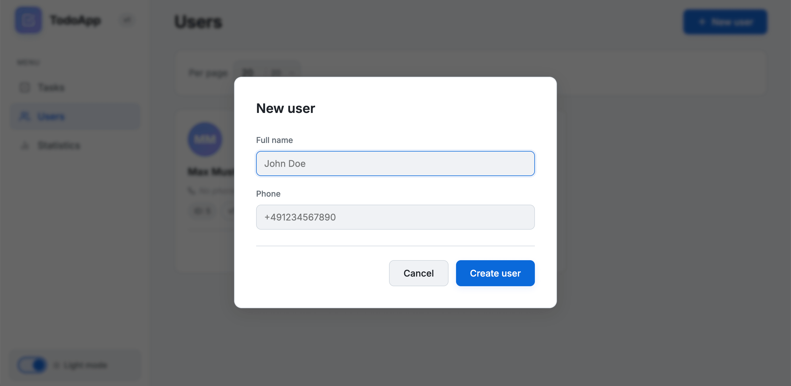
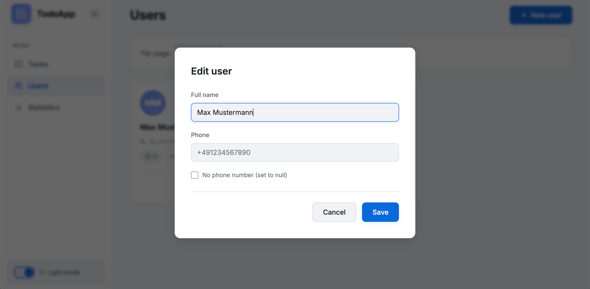
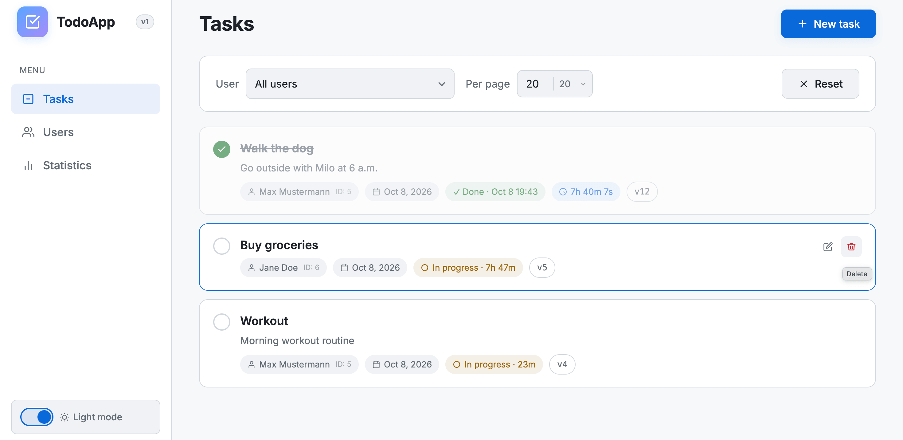
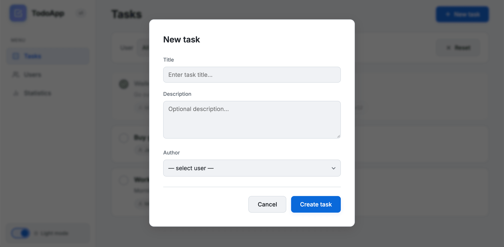
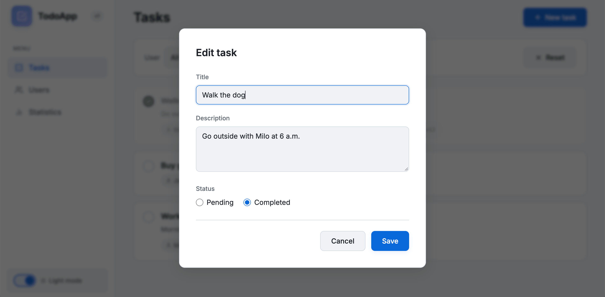
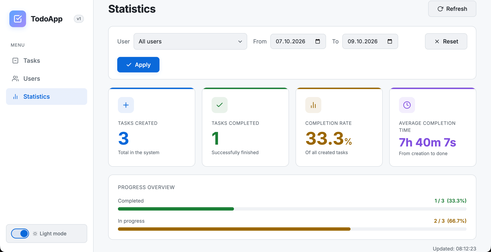
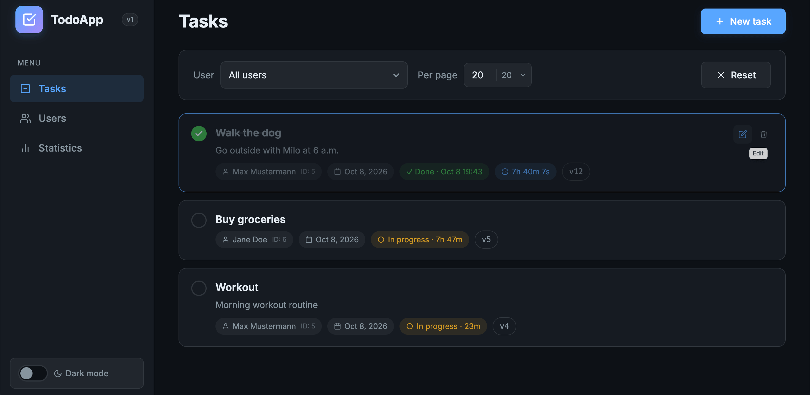

# Go Todo App — REST API

A Todo backend written in Go using only the standard library for HTTP. PostgreSQL for storage, versioned migrations, optimistic locking on updates, and an OpenAPI spec served through Swagger UI.

[](https://go.dev/)
[](https://www.postgresql.org/)
[](https://www.docker.com/)
[](docs/swagger.json)
[](https://github.com/golang-migrate/migrate)

---

## 🗂 Table of Contents

- [About](#-about)
- [Features](#-features)
- [Architecture](#-architecture)
- [Tech Stack](#-tech-stack)
- [Quick Start](#-quick-start)
- [Environment Configuration `.env`](#-environment-configuration-env)
- [CORS & Remote Server Access](#-cors--remote-server-access)
- [API Reference](#-api-reference)
- [Makefile](#-makefile)
- [Project Structure](#-project-structure)
- [Design Notes](#-design-notes)
- [Database & Migrations](#-database--migrations)
- [Screenshots](#-screenshots)
- [Possible Improvements](#-possible-improvements)
- [License](#-license)

---

## 📌 About

**Go Todo App** is a REST API for managing users and their tasks, plus an analytics endpoint for completion statistics. Authentication is intentionally out of scope: the focus here is data modeling, validation, and a clean REST surface rather than identity and session handling.

The code favors explicit layering, validation at both the domain and database level, optimistic concurrency on updates, and structured logging. A small single-page UI is served by the same binary (from `public/index.html`), and the API is documented with Swagger.

---

## ✨ Features

- Users — CRUD, optional pagination, phone-number validation.
- Tasks — CRUD, pagination, filtering by author, `completed` / `completed_at` lifecycle.
- Statistics — created / completed / completion rate / average completion time, optionally filtered by user and date range.
- Three-state PATCH — a nullable field can be omitted, set, or explicitly cleared with `null`.
- Optimistic concurrency — a row `version` guards updates and returns `409 Conflict` on a stale write.
- Built-in UI — a single-page interface served by the same Go binary (`GET /`).
- Swagger UI — interactive API docs at `/swagger/`.
- Feature-sliced layout — each domain is an isolated module (transport → service → repository → domain).
- Docker Compose — app + PostgreSQL + migration runner + port-forwarder + Swagger generator.

---

## 🧱 Architecture

The service is a modular monolith with microservice-style boundaries: each feature is a self-contained module with its own HTTP transport, service (business logic), repository, and domain model. Modules talk to each other only through interfaces, so any of them can be extracted into its own service with little effort.

### High-level view



### Layering per feature

Every feature follows the same dependency direction — outer layers depend on inner ones, never the other way around:

| Layer | Responsibility | Depends on |
|-------|----------------|------------|
| **transport/http** | Decode & validate requests, map DTO ↔ domain, write responses, Swagger annotations | service interfaces |
| **service** | Business rules, orchestration, domain validation | repository interfaces |
| **repository/postgres** | SQL, scanning, mapping DB models ↔ domain | pool, domain |
| **domain** | Entities, value objects (`Nullable[T]`), invariants (`Validate`, `ApplyPatch`) | core errors only |

Interfaces are declared where they are consumed: transport declares the service contract, service declares the repository contract. That keeps the dependency arrows pointing inward and makes the layers easy to substitute.

### Request lifecycle



---

## 🧰 Tech Stack

| Category | Technology | Notes |
|---|---|---|
| **Language** | Go 1.27 | Standard library only for HTTP |
| **HTTP** | `net/http` + `ServeMux` | Method-aware patterns & `{id}` wildcards, no framework |
| **Database** | PostgreSQL 18.6 | `CHECK` constraints mirror domain rules |
| **DB driver** | `jackc/pgx/v5` + `pgxpool` | Connection pool, per-operation timeouts |
| **Migrations** | `golang-migrate` (v4.20.1) | Versioned `.up` / `.down` SQL |
| **Validation** | `go-playground/validator/v10` + custom `Validate()` | DTO and domain level |
| **Config** | `kelseyhightower/envconfig` | 12-factor env vars |
| **Logging** | `uber-go/zap` | Structured, console + file, request-scoped |
| **API docs** | `swaggo/swag` + `http-swagger/v2` | Generated `docs/`, served at `/swagger/` |
| **IDs** | `google/uuid` | Request IDs |
| **Containers** | Docker & Docker Compose | Multi-stage build, Alpine runtime |
| **Tooling** | GNU Make | Full developer workflow |

---

## 🚀 Quick Start

### Prerequisites

- Docker + Docker Compose
- Go 1.27+ (only for local `go run` via `make todo-app-run`)
- GNU Make

### 1. Clone

```bash
git clone https://github.com/apollobing/todo-app.git
cd todo-app
```

### 2. Create `.env` and set the database credentials

```bash
cp .env.example .env
```

Open `.env` and set at minimum:

```dotenv
POSTGRES_USER=your_user
POSTGRES_PASSWORD=your_password
POSTGRES_DB=todo_app
```

The `Makefile` does `include .env` + `export`, so every variable in `.env` is passed to `docker compose` without extra wiring.

### 3. Start PostgreSQL and apply migrations

```bash
make env-up        # start the PostgreSQL container
make migrate-up    # apply all migrations
```

### 4. Run the application

**Option A — Docker:**

```bash
make todo-app-deploy
```

**Option B — locally with Go:**

```bash
make env-port-forward   # expose Postgres on 127.0.0.1:5432
make todo-app-run       # go run ./cmd/todo-app
```

### 5. Open it

| Service | URL |
|---|---|
| Web UI | http://localhost:5050/ |
| Swagger UI | http://localhost:5050/swagger/ |
| API base | http://localhost:5050/api/v1 |

### 6. Stop

```bash
# Option A (Docker)
make todo-app-undeploy

# Option B (local)
make env-port-close

# infrastructure
make env-down
```

The local run (`make todo-app-run`) is a foreground process — `Ctrl+C` triggers a graceful shutdown. `make env-cleanup` additionally removes the database volume (asks for confirmation).

---

## 🔧 Environment Configuration `.env`

`.env.example` is the source of truth:

| Variable | Default | Description |
|---|---|---|
| `HTTP_ADDR` | `:5050` | HTTP listen address |
| `HTTP_SHUTDOWN_TIMEOUT` | `30s` | Graceful shutdown timeout |
| `ALLOWED_ORIGINS` | `http://localhost:5050,null` | Comma-separated CORS allow-list |
| `POSTGRES_HOST` | `todo-app-postgres` | DB host (`localhost` when running via `make todo-app-run`) |
| `POSTGRES_USER` | — | PostgreSQL user (fill in) |
| `POSTGRES_PASSWORD` | — | PostgreSQL password (fill in) |
| `POSTGRES_DB` | — | PostgreSQL database name (fill in) |
| `POSTGRES_TIMEOUT` | `10s` | Per-operation DB timeout |
| `LOGGER_LEVEL` | `DEBUG` | zap level (`DEBUG`, `INFO`, `WARN`, `ERROR`) |
| `TIME_ZONE` | `UTC` | Application time zone |

`POSTGRES_USER`, `POSTGRES_PASSWORD`, and `POSTGRES_DB` are required: config uses `envconfig` with `required:"true"` and fails fast if any is missing.

---

## 🌐 CORS & Remote Server Access

The API only returns CORS headers when the browser's `Origin` header exactly matches an entry in `ALLOWED_ORIGINS`.

If you deploy to a remote host and open the UI in a browser, add that server's public origin (scheme + host + port, no trailing slash):

```dotenv
ALLOWED_ORIGINS=http://86.35.231.79:5050,http://localhost:5050,null
```

- `http://86.35.231.79:5050` — the deployed UI/remote host that issues the requests.
- `http://localhost:5050` — local development.
- `null` — opaque origins, e.g. pages opened via `file://` or sandboxed iframes.

After editing `.env`, recreate the container so the new value is picked up:

```bash
make todo-app-deploy     # or: docker compose up -d --build todo-app
```

The CORS middleware also answers `OPTIONS` preflight requests. Allowed methods: `GET, POST, PATCH, DELETE, OPTIONS`.

---

## 📚 API Reference

Base path: **`/api/v1`**. Responses are `application/json` unless stated otherwise. Errors use a fixed shape:

```json
{ "error": "full error text", "message": "short human-readable message" }
```

| Domain error | HTTP status |
|---|---|
| `ErrInvalidArgument` | `400 Bad Request` |
| `ErrNotFound` | `404 Not Found` |
| `ErrConflict` (stale `version`) | `409 Conflict` |
| anything else | `500 Internal Server Error` |

### Endpoints

| Method | Endpoint | Purpose | Success |
|---|---|---|---|
| `POST` | `/api/v1/users` | Create user | `201` |
| `GET` | `/api/v1/users?limit=&offset=` | List users (optional pagination) | `200` |
| `GET` | `/api/v1/users/{id}` | Get user by ID | `200` |
| `PATCH` | `/api/v1/users/{id}` | Update `full_name` / `phone_number` | `200` |
| `DELETE` | `/api/v1/users/{id}` | Delete user | `204` |
| `POST` | `/api/v1/tasks` | Create task (author must exist) | `201` |
| `GET` | `/api/v1/tasks?user_id=&limit=&offset=` | List tasks (filter by author, paginate) | `200` |
| `GET` | `/api/v1/tasks/{id}` | Get task by ID | `200` |
| `PATCH` | `/api/v1/tasks/{id}` | Update `title` / `description` / `completed` | `200` |
| `DELETE` | `/api/v1/tasks/{id}` | Delete task | `204` |
| `GET` | `/api/v1/statistics?user_id=&from=&to=` | Task statistics (date range `YYYY-MM-DD`) | `200` |
| `GET` | `/` | Built-in web UI | `200` |
| `GET` | `/swagger/` | Swagger UI | `200` |

### Validation rules

**User**
- `full_name` — required, 3–100 chars.
- `phone_number` — optional, 10–15 chars, starts with `+`, digits only.

**Task**
- `title` — required, 1–100 chars.
- `description` — optional, 1–1000 chars.
- `completed` — required boolean.
- `created_at` — read-only, set by the DB on insert.
- `completed_at` — managed by the app:
  - `completed == true` → `completed_at` is set, and `completed_at >= created_at`;
  - `completed == false` → `completed_at IS NULL`.

### Three-state PATCH

PATCH fields use a generic nullable wrapper with three distinct states:

| Client sends | Meaning |
|---|---|
| field omitted | keep the current DB value |
| `"phone_number": "+491234567890"` | set the value |
| `"phone_number": null` | clear the field (`NULL`) |

`full_name`, `title`, and `completed` cannot be set to `null`.

### Examples

**Create a user**

```bash
curl -X POST http://localhost:5050/api/v1/users \
  -H "Content-Type: application/json" \
  -d '{"full_name":"John Doe","phone_number":"+491234567890"}'
```

**Create a task**

```bash
curl -X POST http://localhost:5050/api/v1/tasks \
  -H "Content-Type: application/json" \
  -d '{"author_user_id":1,"title":"Homework","description":"Finish by Thursday"}'
```

**Complete a task (three-state PATCH)**

```bash
curl -X PATCH http://localhost:5050/api/v1/tasks/1 \
  -H "Content-Type: application/json" \
  -d '{"completed":true}'
```

**Clear a phone number**

```bash
curl -X PATCH http://localhost:5050/api/v1/users/1 \
  -H "Content-Type: application/json" \
  -d '{"phone_number":null}'
```

**Statistics for a user over a date range**

```bash
curl "http://localhost:5050/api/v1/statistics?user_id=1&from=2026-01-01&to=2026-02-01"
```

```json
{
  "tasks_created": 50,
  "tasks_completed": 10,
  "tasks_completed_rate": 20,
  "tasks_average_completion_time": "1m30s"
}
```

The machine-readable spec lives in [`docs/swagger.json`](docs/swagger.json) and [`docs/swagger.yaml`](docs/swagger.yaml).

---

## 🔨 Makefile

The `Makefile` is the single entry point for the workflow. It does `include .env` + `export`, so variables reach Docker Compose automatically.

| Target | What it does |
|---|---|
| `make env-up` / `env-down` | Start / stop the PostgreSQL container |
| `make env-cleanup` | Stop Postgres and delete its data volume (asks for confirmation) |
| `make env-port-forward` / `env-port-close` | Expose Postgres on `127.0.0.1:5432` via `socat` |
| `make migrate-create seq=init` | Create a new versioned migration pair |
| `make migrate-up` / `migrate-down` | Apply / roll back migrations |
| `make todo-app-run` | Run locally: `go run`, `POSTGRES_HOST=localhost` |
| `make todo-app-deploy` / `todo-app-undeploy` | Build & run / stop the app container |
| `make swagger-gen` | Regenerate `docs/` from code annotations |
| `make logs-cleanup` | Delete log files (asks for confirmation) |
| `make ps` | Show Compose service status |

---

## 📂 Project Structure

```
todo-app/
├── cmd/todo-app/
│   ├── main.go                 # composition root: wire config, logger, pool, features, server
│   └── Dockerfile              # multi-stage build → minimal Alpine runtime
├── internal/
│   ├── core/                   # shared kernel (reusable across features)
│   │   ├── config/             # time zone / app config
│   │   ├── domain/             # User, Task, Statistics, Nullable[T]
│   │   ├── errors/             # ErrNotFound, ErrInvalidArgument, ErrConflict
│   │   ├── logger/             # zap logger + context helpers
│   │   ├── repository/postgres/pool/  # pgx pool abstraction
│   │   └── transport/http/     # server, API-version router, middleware, request/response
│   └── features/
│       ├── users/              # transport → service → repository → domain
│       ├── tasks/
│       ├── statistics/
│       └── web/                # serves public/index.html
├── migrations/                 # golang-migrate SQL (up/down)
├── docs/                       # generated OpenAPI (swagger.json / .yaml / docs.go)
├── public/index.html           # single-page web UI, served from disk
├── screenshots/                # UI screenshots
├── docker-compose.yaml         # app + postgres + migrate + port-forwarder + swagger
├── Makefile
├── .env.example
└── go.mod
```

---

## 💎 Design Notes

Implementation details that are easy to overlook, with pointers to the code:

- **Routing** — `net/http.ServeMux` with Go 1.22 method + wildcard patterns such as `GET /users/{id}`; no router dependency.
- **Three-state PATCH** — `Nullable[T]` with a custom `UnmarshalJSON` records whether a field was omitted, set, or explicitly `null` (`internal/core/transport/http/types/nullable.go`).
- **Optimistic locking** — updates execute `UPDATE ... SET version = version + 1 WHERE id = $n AND version = $m`; zero rows affected becomes `409 Conflict` (`internal/features/*/repository/postgres/patch_*.go`).
- **Validation in two places** — domain `Validate()` / `ApplyPatch()` plus matching PostgreSQL `CHECK` constraints, so bad data cannot bypass the API layer.
- **Middleware** — CORS, `X-Request-ID`, a request-scoped zap logger stored in `context`, a latency trace, and panic recovery. Attachable globally, per API version, or per route (`internal/core/transport/http/middleware/common.go`).
- **Error mapping** — handlers wrap errors with `%w`; a single response handler maps sentinels with `errors.Is` to `400 / 404 / 409 / 500` (`internal/core/transport/http/response/handler.go`).
- **Shutdown and timeouts** — `signal.NotifyContext` + `server.Shutdown` on the way out; every query runs under a pool-level operation timeout.
- **Config** — all settings come from env vars via `envconfig` and are wired in `main.go`.

---

## 💾 Database & Migrations

Schema: **`todo_app`** with two tables.

```sql
CREATE TABLE todo_app.users (
    id           SERIAL       PRIMARY KEY,
    version      BIGINT       NOT NULL DEFAULT 1,
    full_name    VARCHAR(100) NOT NULL CHECK (char_length(full_name) BETWEEN 3 AND 100),
    phone_number VARCHAR(15)  CHECK (
        phone_number ~ '^\+[0-9]+$'
        AND char_length(phone_number) BETWEEN 10 AND 15
    )
);

CREATE TABLE todo_app.tasks (
    id            SERIAL        PRIMARY KEY,
    version       BIGINT        NOT NULL DEFAULT 1,
    title         VARCHAR(100)  NOT NULL CHECK (char_length(title) BETWEEN 1 AND 100),
    description   VARCHAR(1000)          CHECK (char_length(description) BETWEEN 1 AND 1000),
    completed     BOOLEAN       NOT NULL,
    created_at    TIMESTAMPTZ   NOT NULL,
    completed_at  TIMESTAMPTZ,
    author_user_id INTEGER      NOT NULL REFERENCES todo_app.users(id),
    CHECK (
        (completed = FALSE AND completed_at IS NULL)
        OR (completed = TRUE AND completed_at IS NOT NULL AND completed_at >= created_at)
    )
);
```

Migrations are applied with [`golang-migrate`](https://github.com/golang-migrate/migrate) through Docker:

```bash
make migrate-create seq=add_something   # creates 000002_add_something.{up,down}.sql
make migrate-up
make migrate-down
```

---

## 📸 Screenshots

| Users | New user |
|---|---|
| [](screenshots/users.png) | [](screenshots/new-user.png) |

| Edit user | Tasks |
|---|---|
| [](screenshots/edit-user.png) | [](screenshots/tasks.png) |

| New task | Edit task |
|---|---|
| [](screenshots/new-task.png) | [](screenshots/edit-task.png) |

| Statistics | Dark mode |
|---|---|
| [](screenshots/statistics.png) | [](screenshots/dark-mode.png) |

---

## 💡 Possible Improvements

None of these are commitments — just ideas that could extend the project:

- Automated tests: unit tests for domain/service and integration tests against a real PostgreSQL.
- `/healthz` and `/readyz` endpoints for orchestrators.
- Prometheus metrics.
- Pagination defaults and a hard `limit` cap.
- CI pipeline: `go vet`, staticcheck, tests, image build.
- Authentication and authorization, if the API ever needs to serve untrusted clients.

---

## 📄 License

Released under the MIT License, provided "as is", without warranty of any kind.

---

<div align="center">

Built with ❤️ and pure Go — no web framework.

</div>
